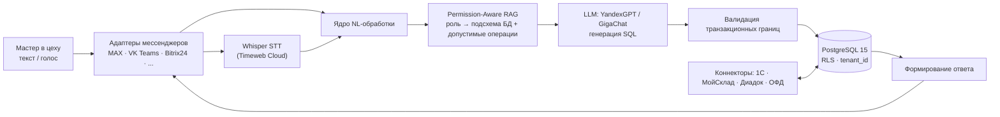

# Мой Цех (Tseh.OS)

**Интеллектуальная диалоговая ERP-система для мелкосерийного производства на базе больших языковых моделей (LLM) и RAG-архитектуры.**

> Победитель федерального конкурса **«Студенческий стартап»** Фонда содействия инновациям, VII очередь, 2026 (заявка СтС-605061, лот Н1 «Цифровые технологии», грант 1 000 000 ₽) · Промышленная эксплуатация на действующем мебельном производстве · ВКР МТУСИ (09.03.01), защищена на «отлично»

**Витринный репозиторий:** кодовая база — коммерческий продукт в эксплуатации у клиентов и не публикуется; здесь открытая инженерная документация проекта. Содержание: [архитектура](docs/architecture.md) · [AI-пайплайн](docs/ai-pipeline.md) · [безопасность и мультитенантность](docs/security-multitenancy.md) · [результаты пилота](docs/results.md) · [примеры диалогов](examples/dialog-examples.md)

---

## Проблема

На микропредприятиях деревообработки и мебельного производства линейный персонал (мастера, сборщики, кладовщики) **не работает в классических настольных ERP**: интерфейсы избыточны, обучение дорого, у рабочего в цеху заняты руки. В результате учёт ведётся на бумаге и «в голове у технолога», склад расходится с реальностью, спецификации теряются.

## Решение

«Мой Цех» переносит бизнес-логику ERP — складской учёт, спецификации изделий, наряды-задания — **в корпоративный мессенджер**, которым сотрудники и так пользуются. Мастер пишет или **наговаривает голосом** обычной фразой с производственным сленгом:

> «принял от Сергея три каркаса кёльна, два со сколами — на переборку»

Система понимает намерение, проверяет права, безопасно транслирует запрос в SQL, проводит операцию и отвечает человеческим языком. Для руководителя это выглядит как «бухгалтер-кладовщик в чате», для базы данных — как строгая транзакция с ролевым контролем.

Это готовая ERP полного производственного контура (склад, спецификации, наряды и контроль качества, сдельная оплата, закупки), а не прототип: ИИ-агент безопасно работает со всеми доменами системы, а готовые интеграции с 1С, МойСклад и Bitrix24 позволяют внедряться поверх существующего учётного ландшафта предприятия, а не «с нуля».

## Ключевые результаты пилота

Апробация на трёх действующих мебельных предприятиях Пензенской области (основная площадка — ООО «Экомебель»); основной хронометраж — 30 мастеров сборочного цеха.

| Метрика | До | После |
|---|---|---|
| Время фиксации производственной спецификации | 5,0 мин | **30 сек (×10)** |
| Точность складского учёта | 67% | **94%** |
| Точность трансляции NL → корректный SQL (корпус 500 реплик со сленгом) | — | **92,4%** |
| Галлюцинации на 1 200 финансовых запросов | — | **0** |

Ноль галлюцинаций на финансовых операциях — это следствие архитектуры, а не удачи: LLM не имеет прямого доступа к данным, генерация ограничена валидируемым подмножеством схемы (см. [AI-пайплайн](docs/ai-pipeline.md)).

## Архитектура в одном абзаце

Ядро — модуль естественно-языковой обработки с фильтром **Permission-Aware RAG**: подмножество схемы БД и перечень допустимых операций отбираются по ролевой модели **до** этапа генерации SQL. Транспортный слой абстрагирован адаптерным интерфейсом: к ядру подключаются российские корпоративные мессенджеры — **MAX (эталонный канал, Bot SDK VK Group)**, VK Teams, МТС Линк, Bitrix24, Yandex Messenger, eXpress, МойОфис Логос — без изменения бизнес-логики. Подсистема внешних коннекторов синхронизирует номенклатуру, остатки и финансовые документы с **1С:ERP / 1С:УНФ / 1С:Бухгалтерия 8.3, МойСклад, Bitrix24 CRM**, СЭД **Контур.Диадок** и операторами фискальных данных. Подробнее: [docs/architecture.md](docs/architecture.md).

## Технологический стек

**Python 3.11 · FastAPI · SQLAlchemy 2.0 (async) · PostgreSQL 15 (row-level security)** · LLM: YandexGPT (Yandex Cloud), GigaChat (СберТех) · STT: Whisper на инфраструктуре Timeweb Cloud. Стек на 100% импортонезависим и соответствует 152-ФЗ: персональные и производственные данные не покидают российскую инфраструктуру.

Масштаб кодовой базы (закрытой): **142 000+ строк** (Python + TypeScript), **50 000+ строк тестов** на четырёх уровнях покрытия, 71 миграция Alembic, 62 доменных сервиса, 42 модуля обработчиков диалоговых событий, девятиуровневая ролевая модель, 10 конвейеров CI/CD.

## Бизнес-модель и статус

- Ниша: **мелкосерийные мебельные и текстильные производства** (в РФ десятки тысяч микропредприятий, для которых 1С:ERP избыточна, а Excel уже недостаточен)
- Модель: B2B SaaS, мультитенантная архитектура (изоляция арендаторов на уровне строк БД)
- Статус: промышленная эксплуатация на ООО «Экомебель», внедрение на двух производствах области; первая платная подписка согласована; грант ФСИ направляется на доработку продукта до тиражируемого SaaS и вывод на рынок
- Связанный проект команды: [signonline.io](https://signonline.io) — сервис онлайн-подписания и верификации документов для малого бизнеса

## Автор

**Александр Майгер** — основатель и руководитель проекта: продукт, архитектура, разработка, внедрение.
Выпускник МТУСИ (09.03.01, специализация «Искусственный интеллект и машинное обучение»), 2026. Призёр акселератора MTUCI.Business 2025 (грант Timeweb Cloud), победитель конкурса ФСИ «Студенческий стартап» 2026.

*Все права защищены. Материалы репозитория — описание собственной разработки автора; коммерческая кодовая база не публикуется. По вопросам сотрудничества и демо — через профиль GitHub.*
