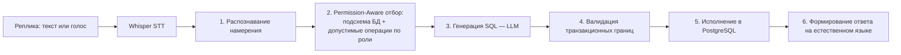

# AI-пайплайн: Permission-Aware RAG и NL → SQL

## Задача

Превратить свободную реплику мастера («принял три каркаса кёльна, два со сколами — на переборку») в **корректную, безопасную и разрешённую этому пользователю** транзакцию в БД — и не дать модели ни единого шанса на галлюцинацию в финансовых данных.

## Шаги исполнения NL-запроса

1. **Распознавание намерения** — классификация реплики (приход, списание, наряд, запрос остатков, финансовый отчёт...).
2. **Permission-Aware Retrieval-Augmented Generation** — ключевое отличие от «подключили LLM к базе»: подмножество схемы и перечень допустимых операций отбираются **на основании ролевой модели до этапа генерации**. Кладовщик физически не может сгенерировать запрос к зарплатным данным: соответствующих таблиц нет в контексте модели.
3. **Генерация SQL** — LLM (YandexGPT / GigaChat) получает только отобранную подсхему и формирует запрос.
4. **Валидация транзакционных границ** — синтаксис, соответствие разрешённым операциям, лимиты, обязательность tenant-контекста; невалидный запрос не исполняется, а уточняется у пользователя.
5. **Исполнение** — строгая транзакция в PostgreSQL с RLS.
6. **Ответ** — человекочитаемое подтверждение с фактическими данными операции.

## Почему 0 галлюцинаций на 1 200 финансовых запросов

Модель никогда не «отвечает из головы»: ответ пользователю формируется из результата исполненного SQL, а не из генерации LLM. Если запрос не прошёл валидацию — система переспрашивает, а не фантазирует. Это архитектурная гарантия, воспроизведённая на корпусе из 1 200 финансовых запросов пилотной эксплуатации.

## Работа со сленгом

Корпус из 500 реальных реплик с производственным сленгом («кёльн», «переборка», «зашкурить») дал точность трансляции NL → корректный SQL **92,4%**. Ошибочные 7,6% не приводят к порче данных: они отсекаются валидатором и уходят в уточняющий диалог.
