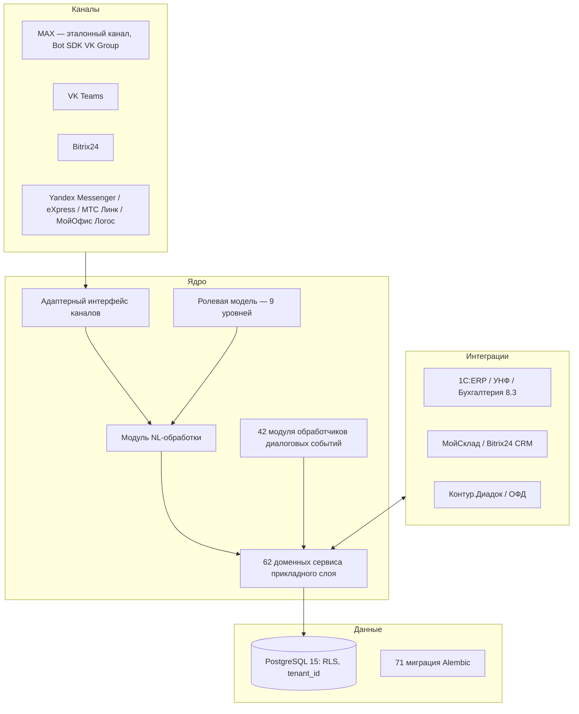

# Архитектура

## Слои системы

Система построена по принципу «ядро не знает о каналах»: бизнес-логика полностью изолирована от транспорта и от конкретной LLM.

## Ключевые инженерные решения

**1. Адаптерный транспортный слой.** Каждый мессенджер подключается реализацией единого интерфейса (входящие события → нормализованное сообщение; исходящие ответы → нативный формат канала). Добавление нового мессенджера не затрагивает бизнес-логику. Эталонный канал пилота — национальный мессенджер MAX (Bot SDK VK Group).

**2. Голос как первичный интерфейс.** У мастера в цеху заняты руки — голосовое сообщение распознаётся моделью Whisper, развёрнутой на серверах Timeweb Cloud (данные не уходят за пределы РФ), и дальше обрабатывается как текст.

**3. LLM за барьером.** Языковая модель (YandexGPT / GigaChat) не имеет доступа ни к данным, ни к полной схеме БД. Она работает только с тем срезом, который прошёл ролевой фильтр (см. [ai-pipeline.md](ai-pipeline.md)), а её выход валидируется до исполнения.

**4. Мультитенантность на уровне СУБД.** Каждая запись обязана иметь `tenant_id`; изоляция арендаторов обеспечивается row-level security PostgreSQL, а не дисциплиной программиста (см. [security-multitenancy.md](security-multitenancy.md)).

**5. Коннекторы к учётным системам.** Продукт не заменяет бухгалтерию предприятия, а встраивается: обмен номенклатурой, остатками и финансовыми документами с 1С (ERP / УНФ / Бухгалтерия 8.3), МойСклад, Bitrix24 CRM, документооборот через Контур.Диадок, чеки — через операторов фискальных данных.

## Масштаб реализации

Python 3.11 · FastAPI · SQLAlchemy 2.0 async · PostgreSQL 15. В закрытой кодовой базе: 142 000+ строк кода (Python + TypeScript), 50 000+ строк тестов (юнит / интеграционные / контрактные / E2E), 71 миграция Alembic, 10 CI/CD-конвейеров (линт, типизация, тесты, сборка, деплой).
